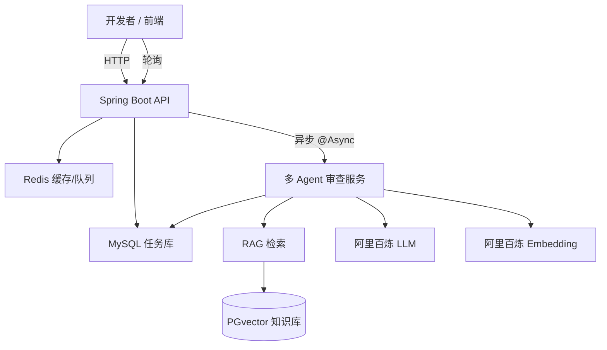

# 智能代码审查助手 - 技术方案设计

> 本文档描述我们正在构建的"智能代码审查助手"项目的技术架构、模块划分、关键实现方案及部署策略。当前已完成：基础框架、AI审查异步化、RAG知识库集成、多Agent并行审查、前端界面。

---

## 1. 总体架构



- **前端**：Vue 3 + Element Plus 构建的 Web 管理界面，支持代码提交、状态轮询、历史记录查看。
- **API 层**：提供任务提交、查询 REST 接口。
- **异步处理层**：使用 `@Async` 线程池处理耗时审查任务，状态持久化到 MySQL。
- **多 Agent 协作层**：LogicAgent、SecurityAgent、PerformanceAgent 并行调用，使用 CompletableFuture 实现任务编排。
- **RAG 模块**：通过 Embedding 模型将规范文档向量化存入 PGvector；审查时根据代码片段检索相似规范，增强 Prompt。
- **AI 调用**：使用 `RestTemplate` + Map 序列化调用阿里百炼兼容接口（避免 JSON 格式问题）。
- **数据存储**：MySQL 存储任务元数据；PGvector 存储知识库向量。

## 2. 模块划分

### 2.1 前端模块（✅ 已实现）
- **代码提交界面**：语言选择、代码输入、提交按钮。
- **结果展示区**：状态标签、Markdown 报告渲染。
- **历史记录页**：表格展示历史任务，点击查看详情。
- **技术栈**：Vue 3 + Element Plus + Axios + marked。

### 2.2 代码审查模块（✅ 已实现）
- **ReviewController**：处理 `/api/review/submit` 和 `/api/review/task/{id}`。
- **ReviewTaskService**：业务逻辑，插入任务后触发 `@Async doReview`。
- **Status 流转**：0（待处理）→ 1（处理中）→ 2（成功）/ 3（失败）。

### 2.3 多 Agent 模块（✅ 已实现）
- **CodeReviewAgent**：Agent 接口定义，规定 `review()` 和 `getAgentName()` 方法。
- **LogicAgent**：逻辑审查专家，检查空指针、边界条件、资源泄漏等。
- **SecurityAgent**：安全审查专家，检查 SQL 注入、XSS、硬编码密码等。
- **PerformanceAgent**：性能审查专家，检查时间复杂度、N+1 查询、缓存策略等。
- **MultiAgentReviewService**：协调三个 Agent 并行执行，汇总结果生成最终报告。

### 2.4 AI 调用模块（✅ 已实现）
- **DirectAliyunAiService**：封装阿里百炼 `qwen-turbo` 调用，支持自定义 Prompt。
- **AliyunEmbeddingService**：调用 `text-embedding-v2` 生成向量，供 RAG 使用。
- **SpringAiCodeReviewService**（已移除）：曾尝试使用 Spring AI ChatClient，因兼容问题弃用。

### 2.5 RAG 知识库模块（✅ 已实现）
- **KnowledgeVectorService**：管理 PGvector 表 `knowledge_docs`，提供 `addDocument` 和 `searchSimilar`。
- **DataSourceConfig**：配置 PostgreSQL 数据源及 `vectorJdbcTemplate`（双数据源）。
- **KnowledgeInitializer**：启动时导入预设规范文档（CommandLineRunner）。

### 2.6 配置与工具
- **双数据源**：MySQL（主）、PostgreSQL（向量），通过 `@Qualifier` 区分。
- **MyBatis-Plus**：简化 MySQL 操作。
- **Lombok**：减少样板代码。

## 3. 核心代码结构

```
code-review-agent/
├── src/main/java/com/agent/codereview/
│   ├── CodeReviewAgentApplication.java   // 启动类，含 @EnableAsync
│   ├── controller/
│   │   └── ReviewController.java
│   ├── service/
│   │   ├── ReviewTaskService.java
│   │   ├── impl/ReviewTaskServiceImpl.java
│   │   ├── KnowledgeVectorService.java
│   │   └── impl/KnowledgeVectorServiceImpl.java
│   ├── ai/
│   │   ├── DirectAliyunAiService.java
│   │   └── AliyunEmbeddingService.java
│   ├── agent/
│   │   ├── CodeReviewAgent.java            // Agent 接口
│   │   ├── LogicAgent.java                 // 逻辑审查 Agent
│   │   ├── SecurityAgent.java              // 安全审查 Agent
│   │   ├── PerformanceAgent.java          // 性能审查 Agent
│   │   └── MultiAgentReviewService.java    // 多 Agent 协调服务
│   ├── config/
│   │   └── DataSourceConfig.java           // 双数据源配置
│   ├── init/
│   │   └── KnowledgeInitializer.java       // 启动时初始化知识库
│   ├── mapper/
│   │   └── ReviewTaskMapper.java
│   └── entity/
│       └── ReviewTask.java

code-review-frontend/
├── src/
│   ├── api/
│   │   └── review.js                       // API 调用封装
│   ├── assets/
│   │   └── main.css                       // 全局样式
│   ├── App.vue                             // 主界面（包含所有业务逻辑）
│   ├── main.js                             // Vue 入口
│   └── router/
│       └── index.js                        // 路由配置
```

## 4. 关键技术实现

### 4.1 异步审查
```java
@Async
public void doReview(Long taskId) {
    // 1. 更新状态为处理中
    // 2. 调用 MultiAgentReviewService.reviewWithMultiAgents()
    // 3. 更新结果或失败原因
}
```
- 线程池使用 Spring 默认 `SimpleAsyncTaskExecutor`（生产环境应自定义）。
- 事务注意事项：`@Async` 方法不参与调用方事务，需独立管理。

### 4.2 多 Agent 并行执行
```java
// MultiAgentReviewService.reviewWithMultiAgents()
CompletableFuture<String> logicFuture = CompletableFuture.supplyAsync(() -> logicAgent.review(code, lang));
CompletableFuture<String> securityFuture = CompletableFuture.supplyAsync(() -> securityAgent.review(code, lang));
CompletableFuture<String> performanceFuture = CompletableFuture.supplyAsync(() -> performanceAgent.review(code, lang));

CompletableFuture.allOf(logicFuture, securityFuture, performanceFuture).get();
```
- 三个 Agent 并行调用，提高审查效率。
- 每个 Agent 独立进行 RAG 检索，获取相关规范增强 Prompt。

### 4.3 RAG 检索增强
```java
List<String> rules = knowledgeVectorService.searchSimilar(codeContent, 3);
String knowledgeContext = rules.isEmpty() ? "" : "\n\n【相关规范】\n" + String.join("\n", rules);
String userPrompt = String.format("语言：%s\n\n代码：\n%s%s", language, codeContent, knowledgeContext);
```
- 向量检索使用 `<->` 余弦距离，按相似度排序。
- 每个 Agent 根据自身职责检索相关规范（如 SecurityAgent 检索安全相关规范）。

### 4.4 双数据源配置
```java
@Configuration
public class DataSourceConfig {
    @Bean(name = "vectorDataSource")
    @ConfigurationProperties(prefix = "spring.vector-datasource")
    public DataSource vectorDataSource() { ... }

    @Bean(name = "vectorJdbcTemplate")
    public JdbcTemplate vectorJdbcTemplate(@Qualifier("vectorDataSource") DataSource ds) { ... }
}
```
- 主数据源由 Spring Boot 自动配置，读取 `spring.datasource.*`。
- 向量数据源手动配置，前缀为 `spring.vector-datasource`，需添加 `@Primary` 注解确保主数据源正确。

### 4.5 阿里百炼 API 调用（已修复）
- **embedding**：`POST https://dashscope.aliyuncs.com/compatible-mode/v1/embeddings`，模型 `text-embedding-v2`。
- **chat**：`POST https://dashscope.aliyuncs.com/compatible-mode/v1/chat/completions`，模型 `qwen-turbo`。
- 使用 `Map<String, Object>` 对象序列化，避免字符串拼接导致的 JSON 格式错误。

### 4.6 前端轮询机制
```javascript
// 定时轮询任务状态
const startPolling = (taskId) => {
  pollingTimer = setInterval(async () => {
    const task = await getTask(taskId)
    if (task.status === 2 || task.status === 3) {
      stopPolling()  // 完成，停止轮询
    }
  }, pollingInterval)
}
```

## 5. 数据库设计

### 5.1 MySQL – `review_task`
```sql
CREATE TABLE review_task (
    id BIGINT AUTO_INCREMENT PRIMARY KEY,
    code_content TEXT NOT NULL,
    lang VARCHAR(20) DEFAULT 'java',
    status TINYINT DEFAULT 0,
    result_summary TEXT,
    created_at DATETIME DEFAULT CURRENT_TIMESTAMP,
    updated_at DATETIME DEFAULT CURRENT_TIMESTAMP ON UPDATE CURRENT_TIMESTAMP
);
```

### 5.2 PostgreSQL – `knowledge_docs`
```sql
CREATE EXTENSION vector;
CREATE TABLE knowledge_docs (
    id SERIAL PRIMARY KEY,
    title TEXT NOT NULL,
    content TEXT NOT NULL,
    embedding vector(1536)
);
CREATE INDEX ON knowledge_docs USING ivfflat (embedding vector_cosine_ops);
```

## 6. 部署配置

### 6.1 配置文件 (application.properties)
```properties
# MySQL
spring.datasource.url=jdbc:mysql://localhost:3306/code_review?useSSL=false&serverTimezone=Asia/Shanghai
spring.datasource.username=root
spring.datasource.password=123456
spring.datasource.driver-class-name=com.mysql.cj.jdbc.Driver

# PostgreSQL vector
spring.vector-datasource.url=jdbc:postgresql://localhost:5432/knowledge_db
spring.vector-datasource.username=postgres
spring.vector-datasource.password=123456

# AI
spring.ai.openai.api-key=sk-xxxx
spring.ai.openai.base-url=https://dashscope.aliyuncs.com/compatible-mode/v1
spring.ai.openai.chat.options.model=qwen-turbo

# 异步配置
spring.task.execution.pool.core-size=5
spring.task.execution.pool.max-size=10
```

### 6.2 Docker 运行依赖
```bash
docker run --name mysql8 -e MYSQL_ROOT_PASSWORD=123456 -p 3306:3306 -d mysql:8.0
docker run --name redis7 -p 6379:6379 -d redis:7-alpine
docker run --name pgvector -e POSTGRES_PASSWORD=123456 -p 5432:5432 -d pgvector/pgvector:pg16
```

### 6.3 项目打包与启动
```bash
# 后端
cd code-review-agent
mvn clean package
java -jar target/code-review-agent-0.0.1-SNAPSHOT.jar

# 前端
cd code-review-frontend
npm install
npm run dev
```

## 7. API 接口说明

### 7.1 提交审查任务
- **URL**: `POST /api/review/submit`
- **请求体**:
```json
{
    "codeContent": "public void getUser(String id) { User u = userDao.findById(id); System.out.println(u.getName()); }",
    "lang": "java"
}
```
- **响应**: `{"taskId": 1}`

### 7.2 查询审查结果
- **URL**: `GET /api/review/task/{taskId}`
- **响应**:
```json
{
    "id": 1,
    "codeContent": "...",
    "lang": "java",
    "status": 2,
    "resultSummary": "# 代码审查报告\n\n## 概览\n...",
    "createdAt": "2026-05-04T10:30:00",
    "updatedAt": "2026-05-04T10:30:05"
}
```

## 8. 测试计划

### 8.1 集成测试（curl 脚本）
```bash
# 提交任务
curl -X POST http://localhost:8080/api/review/submit \
  -H "Content-Type: application/json" \
  -d '{"codeContent":"public void getUser(String id) { User u = userDao.findById(id); System.out.println(u.getName()); }", "lang":"java"}'

# 查询结果（等待 30 秒后）
curl http://localhost:8080/api/review/task/1
```

### 8.2 RAG 效果验证
- 预先导入规范，提交包含"空指针"的代码，检查返回结果是否引用了相关规范。

### 8.3 多 Agent 功能验证
- 提交包含安全漏洞的代码，验证 SecurityAgent 是否能识别问题。
- 提交包含性能问题的代码，验证 PerformanceAgent 是否能识别问题。

## 9. 已完成功能清单

| 模块 | 功能 | 状态 | 说明 |
|------|------|------|------|
| 前端 | 代码提交界面 | ✅ | Vue 3 + Element Plus，现代化 UI |
| 前端 | 状态轮询展示 | ✅ | 实时进度展示 |
| 前端 | Markdown 渲染 | ✅ | marked 库美化报告 |
| 前端 | 历史记录 | ✅ | localStorage 存储 |
| API | 代码提交接口 | ✅ | POST /api/review/submit |
| API | 结果查询接口 | ✅ | GET /api/review/task/{id} |
| 异步 | @Async 异步处理 | ✅ | 任务状态流转管理 |
| RAG | 文档向量化 | ✅ | 启动时导入预设规范 |
| RAG | 相似性检索 | ✅ | searchSimilar() 方法 |
| Agent | LogicAgent | ✅ | 逻辑审查专家 |
| Agent | SecurityAgent | ✅ | 安全审查专家 |
| Agent | PerformanceAgent | ✅ | 性能审查专家 |
| Agent | MultiAgentReviewService | ✅ | 并行调用 + 结果汇总 |
| 数据源 | 双数据源配置 | ✅ | MySQL + PostgreSQL |

## 10. 后续优化方向

| 功能 | 说明 | 优先级 |
|------|------|--------|
| **Agent 结果缓存** | 使用 Redis 缓存相同代码的审查结果 | 高 |
| **动态 Agent 选择** | 根据代码语言、长度、关键词决定启用哪些 Agent | 中 |
| **流式返回** | 使用 SSE 或 WebSocket 推送审查进度 | 中 |
| **汇总 Prompt 优化** | 为每个问题给出统一的优先级排序（严重/中等/建议） | 中 |
| **Swagger API 文档** | 自动生成 API 文档 | 中 |
| **Docker 部署脚本** | docker-compose.yml 一键部署 | 高 |
| **Git PR 集成** | 监听 GitHub Webhook，自动审查 PR | 低 |

## 11. 注意事项

- 确保 PostgreSQL 的 `vector` 扩展已安装（Windows 下需手动编译或使用预编译包）。
- 主数据源配置必须正确，否则整个容器无法启动。
- API Key 不应硬编码，生产环境使用环境变量或配置中心。
- 异步线程池需根据服务器资源调整，避免 OOM。
- 多 Agent 并行调用会增加 AI API 调用次数，需注意成本控制。
- 使用 Map 对象序列化 JSON，避免字符串拼接导致的格式问题。

---

**文档版本**：1.2
**最后更新**：2026-05-04
**编写者**：开发团队
**更新说明**：
- v1.2：添加前端模块说明，更新核心代码结构，补充前端轮询机制说明
- v1.1：根据实际实现更新，添加了多 Agent 模块说明，补充了 API 接口文档
