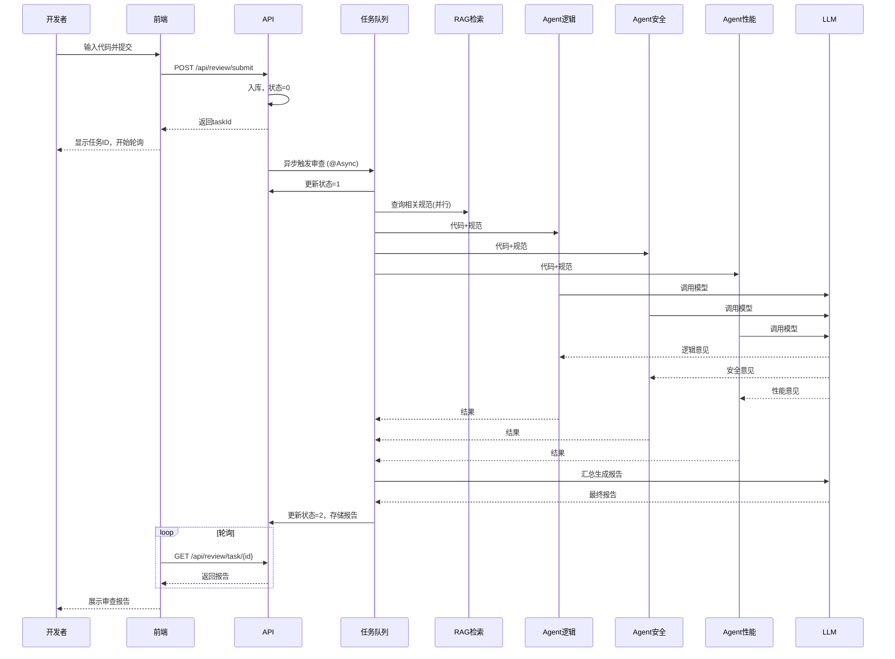

# 智能代码审查助手 - 需求分析文档

## 1. 项目背景

在软件开发过程中，代码审查是保障代码质量、发现潜在缺陷、统一编码风格的重要手段。然而，传统的人工审查存在以下痛点：

- **效率低下**：审查耗时较长，尤其在大型代码变更或团队规模较大时，成为开发流程的瓶颈。
- **标准不一**：不同审查者的经验和侧重点不同，导致审查结果不一致，难以沉淀最佳实践。
- **知识传承困难**：企业编码规范、安全规范等文档往往与代码库脱节，审查时依赖人工记忆，容易遗漏。
- **反馈周期长**：提交 PR 后等待人工审查，开发者需要频繁切换上下文，影响开发效率。

随着大语言模型（LLM）的快速发展，利用 AI 辅助甚至自动执行代码审查成为可能。本项目旨在构建一个**基于 Spring Boot + RAG + Multi-Agent 的智能代码审查助手**，为开发团队提供高效、标准、可扩展的自动化代码审查能力。

## 2. 项目目标

### 2.1 核心目标（✅ 已实现）
- ✅ 实现 **AI 驱动的代码审查**：自动分析代码片段，识别潜在的错误、性能问题、安全漏洞及可读性问题，并生成结构化的审查报告。
- ✅ 引入 **RAG（检索增强生成）**：通过向量知识库存储企业编码规范、安全规范等，使 AI 在审查时能够参考相关规范，提高审查的专业性和准确性。
- ✅ 支持 **多 Agent 协作**：模拟真实审查场景，由逻辑、安全、性能三个专业 Agent 并行分析，最终汇总生成全面报告。
- ✅ 提供 **异步任务处理**：审查过程不阻塞用户请求，通过任务状态轮询获取结果，保证系统高吞吐。

### 2.2 拓展目标（✅ 已实现部分）
- ✅ 具备 **Web 管理界面**：开发者可提交代码、查看历史记录；技术负责人可管理知识库文档。
- ⬜ 支持 Git PR 集成：自动监听代码仓库的 Pull Request，触发审查并评论。
- ⬜ 提供 MCP（Model Context Protocol）服务：作为 Agent 能力被其他 AI 工具调用。
- ⬜ 支持多编程语言（Java、Python、JavaScript 等）。

### 2.3 高级功能（规划中）
- ⬜ **缓存 Agent 结果**：相同代码重复审查时直接返回缓存，减少 API 调用成本。
- ⬜ **动态 Agent 选择**：根据代码语言、长度、关键词决定启用哪些 Agent。
- ⬜ **流式返回**：使用 Spring WebFlux，边生成边推送报告片段，提升用户体验。
- ⬜ **汇总 Prompt 优化**：为每个问题给出统一的优先级排序（严重/中等/建议）。

## 3. 用户角色

| 角色         | 描述                                                         | 核心需求                                   |
| ------------ | ------------------------------------------------------------ | ------------------------------------------ |
| **开发者**   | 日常提交代码，希望快速获得 AI 审查反馈。                     | 提交代码片段，查看审查报告，跟踪任务状态。 |
| **技术负责人** | 维护编码规范，管理知识库，查看团队审查统计。                 | 上传/更新规范文档，查看审查趋势。          |
| **管理员**   | 系统运维，监控服务状态，配置模型参数。                       | 查看系统日志，配置 API Key，监控性能指标。 |

## 4. 功能需求

### 4.1 前端界面（✅ 已实现）

| 页面         | 功能                                                         | 状态   |
| ------------ | ------------------------------------------------------------ | ------ |
| 审查任务页   | 表单输入代码，提交后显示任务 ID 和状态轮询，审查完成后展示报告（Markdown 渲染）。 | ✅ 已实现 |
| 历史记录页   | 表格展示历史任务，点击查看详情。                              | ✅ 已实现 |

**前端技术特性**：
- 现代化 UI：渐变背景、圆角卡片、动画效果
- 深色代码编辑器
- 实时状态轮询 + 加载动画
- Markdown 报告美化渲染
- 本地存储历史记录

### 4.2 代码审查核心流程（✅ 已实现）

| 功能模块         | 详细描述                                                     | 状态   |
| ---------------- | ------------------------------------------------------------ | ------ |
| 代码提交接口     | 开发者通过 REST API 提交代码内容（支持文本），指定编程语言。系统返回唯一任务 ID。 | ✅ 已实现 |
| 异步审查引擎     | 后端异步处理任务，状态流转：待处理(0) → 处理中(1) → 成功(2)/失败(3)。 | ✅ 已实现 |
| RAG 知识库检索   | 审查前根据代码片段检索相关编码规范、安全规范，将检索结果拼接到 Prompt 中。 | ✅ 已实现 |
| 多 Agent 协作    | 三个 Agent（逻辑、安全、性能）使用 CompletableFuture 并行调用大模型，分别给出维度意见。 | ✅ 已实现 |
| 报告生成与汇总   | 将多维意见合并，调用大模型生成结构化 Markdown 报告，包含问题列表、改进建议。 | ✅ 已实现 |
| 结果查询接口     | 开发者通过任务 ID 查询审查状态和报告。                        | ✅ 已实现 |

### 4.3 知识库管理（✅ 已实现）

| 功能             | 详细描述                                                     | 状态   |
| ---------------- | ------------------------------------------------------------ | ------ |
| 文档向量化       | 支持上传规范文档，自动调用嵌入模型生成向量，存入向量数据库。   | ✅ 已实现（启动时导入预设规范） |
| 文档检索         | 根据查询文本返回最相似的 topK 条规范内容。                   | ✅ 已实现 |
| 向量存储         | 使用 PGvector（PostgreSQL 扩展）作为向量数据库，支持高效相似度检索。 | ✅ 已实现 |
| 文档增删改查     | 技术负责人可管理知识库中的文档（后续通过管理界面）。          | ⬜ 待实现 |

### 4.4 系统监控与运维（待实现）

| 功能           | 描述                                                         | 状态   |
| -------------- | ------------------------------------------------------------ | ------ |
| 日志记录       | 记录请求日志、AI 调用耗时、错误堆栈。                        | ✅ 已使用（Logback/SLF4J） |
| 性能监控       | 通过 Prometheus + Grafana 收集 API QPS、AI 调用延迟、数据库连接池状态。 | ⬜ 待实现 |
| 告警           | 配置 AI 调用失败率阈值、数据库连接异常等告警规则。           | ⬜ 待实现 |
| 健康检查       | 提供 `/actuator/health` 端点，供容器编排使用。               | ⬜ 待实现 |

## 5. 非功能需求

| 类型         | 具体要求                                                     |
| ------------ | ------------------------------------------------------------ |
| **性能**     | - 单节点支持 50 并发任务提交。 - AI 审查平均耗时 ≤ 8 秒（含网络延迟）。 - 接口响应时间（提交任务）≤ 200ms。 |
| **可用性**   | - 关键服务（数据库、Redis）需高可用。 - 异步任务失败后自动重试（最多 3 次）。 |
| **可扩展性** | - 支持水平扩展（任务状态存储在 Redis/数据库，无状态设计）。 - Agent 模型可插拔（支持 OpenAI、通义千问等）。 |
| **安全性**   | - API Key 加密存储（使用 Jasypt 或环境变量）。 - 防止 SQL 注入、XSS。 - 审查内容仅用于该次任务，不持久化原始代码（可选配置）。 |
| **易用性**   | - 提供清晰的 API 文档（Swagger/OpenAPI）。 - 前端界面直观，支持移动端响应式。 |

## 6. 技术栈

| 层级           | 技术选型                                                     |
| -------------- | ------------------------------------------------------------ |
| 后端框架       | Spring Boot 3.4.2 + Spring JDBC                              |
| 数据库         | MySQL 8.0（任务、用户元数据） + PostgreSQL 18 + pgvector（知识库向量） |
| 缓存/队列      | Redis 7.x（任务状态缓存、异步队列）                           |
| AI 模型        | 阿里通义千问（qwen-turbo） + text-embedding-v2              |
| AI 调用方式    | RestTemplate（原生 HTTP + Map 序列化）                         |
| 前端           | Vue 3 + Element Plus + Axios + marked                        |
| 部署           | Docker + docker-compose + Nginx（待实现）                    |
| 监控           | Prometheus + Grafana（待实现）                               |
| 构建工具       | Maven 3.8+                                                  |
| 开发工具       | IntelliJ IDEA / Eclipse + Lombok 插件                        |

## 7. 数据模型简表

### 7.1 审查任务表（MySQL）

| 字段名         | 类型          | 描述                   |
| -------------- | ------------- | ---------------------- |
| id             | BIGINT        | 主键                   |
| code_content   | TEXT          | 待审查代码内容         |
| lang           | VARCHAR(20)   | 编程语言               |
| status         | TINYINT       | 0待处理，1处理中，2成功，3失败 |
| result_summary | TEXT          | 审查报告（Markdown）   |
| created_at     | DATETIME      | 创建时间               |
| updated_at     | DATETIME      | 更新时间               |

### 7.2 知识库文档表（PostgreSQL）

| 字段名     | 类型            | 描述                      |
| ---------- | --------------- | ------------------------- |
| id         | SERIAL          | 主键                      |
| title      | TEXT            | 文档标题                  |
| content    | TEXT            | 规范内容                  |
| embedding  | vector(1536)    | 向量表示（pgvector 扩展） |

## 8. 关键流程时序图（简化）

## 9. 风险与应对

| 风险                         | 应对措施                                                     |
| ---------------------------- | ------------------------------------------------------------ |
| AI 模型生成内容不准确        | 使用 RAG 增强提示，限制模型发挥；提供人工反馈机制，持续优化 Prompt。 |
| 向量检索耗时过长             | 建立向量索引（IVFFlat/HNSW）；限制检索 topK 值；考虑缓存高频查询。 |
| 多 Agent 并行调用导致成本上升 | 控制并发数，对简单代码直接使用单 Agent；使用成本更低的模型（qwen-turbo）。 |
| PostgreSQL + pgvector 性能不足 | 采用专用向量数据库（如 Milvus）替代；或定期优化索引。          |
| 异步任务丢失                 | 使用持久化队列（Redis Stream + 备份）；任务失败重试机制。      |

## 10. 项目范围与交付物

### 10.1 已完成
- ✅ 后端 API 开发（提交、查询）
- ✅ RAG 知识库搭建（文档导入、向量检索）
- ✅ 多 Agent 并行审查逻辑（LogicAgent、SecurityAgent、PerformanceAgent）
- ✅ 异步任务框架（@Async）
- ✅ 启动时知识库初始化（预设规范文档导入）
- ✅ Web 前端界面（Vue 3 + Element Plus）

### 10.2 待完成
- ⬜ Web 管理界面增强（知识库文档管理）
- ⬜ Docker 部署脚本
- ⬜ API 文档（Swagger）
- ⬜ 监控告警系统
- ⬜ Redis 缓存集成

### 10.3 后续迭代计划

| 迭代 | 功能 | 预估时间 |
|------|------|----------|
| V1.1 | Web 管理界面、Swagger API 文档 | 1-2 天 |
| V1.2 | Redis 缓存优化、Agent 结果缓存 | 1 天 |
| V1.3 | Docker 部署脚本、健康检查端点 | 1 天 |
| V1.4 | 动态 Agent 选择、流式返回 | 2 天 |
| V1.5 | Git PR 集成、MCP 服务支持 | 2-3 天 |

---

**文档版本**：1.2
**编写日期**：2026-05-04
**编写人**：开发团队
**更新说明**：
- v1.2：标记前端已完成，更新项目状态，添加风险应对说明
- v1.1：根据实际实现更新，添加了已完成/待完成状态标记，补充了后续迭代计划
